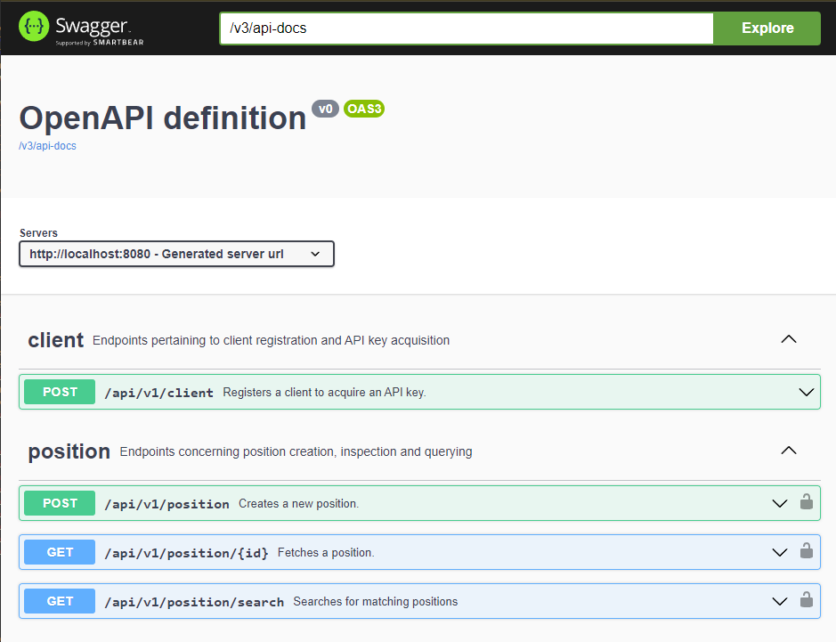

# Position Finder

## Introduction

The project contains a BE service satisfying the requirements of the provided API description. To
demonstrate the **"contract first"**-style implementation, the application comes with a VueJS client
bundled, which consumes the implemented API.

### Structure

- The API is defined by an OpenAPI definition found in
  the [spec folder](./spec/position-finder-api-v1.yaml).
- The application is implemented with Spring Boot 2.7, running on Java 11.
    - The controller layer is generated from the above YAML document
    - An API service layer is implemented. This layer performs validation on request payloads,
      invokes
      domain services and converts domain objects into API-compliant DTOs
    - A domain service layer interacts with the data access layer
    - Data access is provided with a file-system H2 database through the Spring Data JDBC ORM.
    - Spring Security is used to check for authorization on protected endpoints. A
      custom `OncePerRequestFilter` checks for the presence and validity of the API
      key ([ApiKeyFilter](./app/src/main/java/hu/aestallon/bredex/positionfinder/app/rest/auth/ApiKeyFilter.java)),
      the security configuration is found
      at [PositionFinderSecurityConfig](/app/src/main/java/hu/aestallon/bredex/positionfinder/app/config/PositionFinderSecurityConfig.java)
- The client is implemented with Vue 3 with the Vuetify component library. Dependency management is
  performed using npm. The API is consumed by the Axios HTTP client, using classes generated from
  the above YAML document.

#### Request Authorization Flow


#### Persistence Relations


### Tests

For the business logic implemented by the application is minuscule, integration tests are provided
to verify the service's behaviour:

- A black box suite for checking the behaviour of the
  authorization: [WebAuthorizationTest](./app/src/test/java/hu/aestallon/bredex/positionfinder/app/rest/auth/WebAuthorizationTest.java)
- And white box tests for checking the correct behaviour of the API in
  the [integration](./app/src/test/java/hu/aestallon/bredex/positionfinder/app/integration/) package

A total of 23 tests are provided with 100% coverage on service-type classes.


## Getting Started

### Requirements

To build the application, the following needs to be installed and available in the
environments `PATH` variable:

- JDK 11+
- NodeJS 20.11.1+ (to build the bundled VueJS client)

### Building

Standing in the project root, run the following to create an executable JAR:

- On Linux/MacOS:
  ```shell
  ./gradlew app:build
  ```
- On Windows:
  ```shell
  -.\gradlew.bat app:build
  ```

To execute the built archive, run the following:

- On Linux/MacOS:
  ```shell
  java -Dspring.profiles.active=h2 -jar ./build/libs/app-1.0.0.jar
  ```
- On Windows:
  ```shell
  java -Dspring.profiles.active=h2 -jar .\build\libs\app-1.0.0.jar
  ```

## Running

### VueJS client

A bundled VueJS client is available locally at `localhost:8080` to interact with the API:

#### Landing page:


#### Creating a New Client


All forms are validated both BE and FE side:


#### Adding a New Positions


#### Searching for Positions


### SwaggerUI

Swagger UI for the provided API is available at http://localhost:8080/swagger-ui/index.html



The JSON dump of the API is available at http://localhost:8080/v3/api-docs

